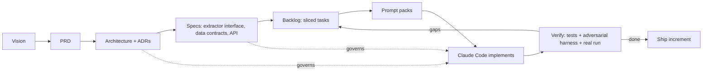

# AcquireIntel — AI-Native Engineering Kit

> This repo is **both** the durable **engineering kit** (vision, PRD, architecture, ADRs,
> specs, backlog, prompts — the source of truth for *what to build* and *how*) **and the
> implemented app itself**, built nested here as one coherent codebase (`src/acquire_intel/`,
> `harness/`, `tests/`). The kit outlives any single coding session; the app is the thing it
> produced. **To just run it, jump to [Run the app — 5-minute demo](#run-the-app--5-minute-demo).**

---

## Run the app — 5-minute demo

A fresh clone to a working demo — crawl a store, watch the anti-bot layer recover from a block,
then serve the price data through the API + dashboard. Everything runs against a **local
adversarial mock server** (no live site), so it is deterministic.

**Prerequisites:** [uv](https://docs.astral.sh/uv/) and Docker.

```bash
make setup     # once: write a dev .env, start Postgres, apply migrations
make demo      # crawl the harness (happy + block_after_n + captcha) so there's data
make run       # the app (JSON API + dashboard) at http://localhost:5000
```

That's the whole thing — `make run` is the app (the Flask process serves **both** the JSON API and
the server-rendered dashboard, so there's no separate frontend to start), and `make demo` feeds it
data. `make help` lists every target. **[`RUN.md`](RUN.md)** is the full run/troubleshoot guide.

### Demo data vs. a real store — and switching between them

The **same engine** crawls the local mock or a real store; only the source URL changes. The mock is
the deterministic *adversary* used to prove the anti-bot layer (rotation/backoff/ban detection) —
it isn't the product. To crawl **real products and prices** instead:

```bash
make live                                   # crawls https://www.deathwishcoffee.com (real Shopify store)
make live STORE=https://www.allbirds.com    # …or any store with an open /products.json
make run                                    # same app, now showing the real catalogue
```

- `make demo` → source **`demo_rest`** (mock harness): deterministic, tells the resilience story.
- `make live` → source **`live_rest`** (a real store): real catalogue + current prices, obeying
  `robots.txt`, public data only (docs/08). Verified live: 132 products from Death Wish Coffee.
- The two are **separate sources** and coexist on the dashboard, so switching is just running the
  other command. Want a clean slate showing only one? `make reset` wipes all crawled data first.

Real **price history** accumulates once you crawl a store repeatedly over time — exactly what the
built-in scheduler (`SCHEDULER_ENABLED`) is for. A single crawl gives real prices at one point in time.

Prefer to see the moving parts? The same demo flow, by hand:

<details><summary>Run it step by step (what <code>make demo</code> does)</summary>

```bash
# Terminal 1 — the adversarial store. `--block-after 1` blocks an identity after one request,
# so a single crawl has to rotate identity to finish.
uv run python -m harness.server --block-after 1

# Terminal 2 — three crawls telling the resilience story:
uv run python scripts/demo_seed.py --scenario happy         && uv run acquire-intel crawl demo_rest
#   → 3 products + price observations persisted (run status: success).

uv run python scripts/demo_seed.py --scenario block_after_n && uv run acquire-intel crawl demo_rest
#   → log shows `resilience.identity_rotated ... kind=blocked`; the FULL catalogue is still
#     collected — it got a 403, rotated to a fresh coherent browser identity, and recovered.

uv run python scripts/demo_seed.py --scenario captcha       && uv run acquire-intel crawl demo_rest
#   → `ban_events=1`, 0 items; `price_observations` is unchanged (a challenge page is not data).
```

</details>

Once `make run` is up, open / curl:

| URL | Shows |
|-----|-------|
| `http://127.0.0.1:5000/` | Dashboard: product table, price charts, crawler-health panel (ban-rate, rotations) |
| `.../api/v1/products` | Collected products with latest price + freshness |
| `.../api/v1/products/demo_rest:9001/price-history` | Append-only price time-series for one product |
| `.../api/v1/health/sources` | Per-source `healthy`/`degraded`/`stale`/`failing` + `banRate` |
| `.../api/v1/metrics` | Crawl/ban counters + gauges (docs/07 §4) |

Other harness scenarios (`rate_limited`, `cookie_wall`, `soft_ban`, `drift`) are runnable the same
way (`--scenario ...`); the full recovery matrix is proven deterministically in
`tests/test_resilience_integration.py` against all seven. To trigger a crawl over HTTP instead of the
CLI: `curl -X POST -H "Authorization: Bearer $ADMIN_TOKEN" .../api/v1/admin/crawl` (no token → 401).

---

## What you are building

**AcquireIntel** is a **resilient, pluggable data-acquisition platform** in **Python**. Its
flagship dataset is **product & price intelligence**: it crawls online stores, extracts
product and price data through **three different acquisition techniques** — HTML scraping
(Scrapy + Playwright), **REST** APIs, and **GraphQL** APIs — stores an append-only
**price-history** time-series, and surfaces it through a **Flask** API + light dashboard.

The **star of the project is the acquisition engine and its anti-bot resilience layer**:
proxy rotation, fingerprint/header/cookie rotation, adaptive rate-limiting, backoff/retry,
ban detection, and session pools — all proven against a **local adversarial mock server**
you control (so the hard parts are deterministically testable) plus friendly real
endpoints.

It is deliberately shaped to demonstrate the exact competencies of a **Data Acquisition /
Research Engineer** role: Python; Scrapy/Playwright; REST + GraphQL; data collection in
adversarial environments (rate limits, blocking, anti-bot); networking fundamentals
(proxies, headers, cookies); scalable pipelines; data-quality monitoring; CI/CD.

---

## Why "AI-native engineering" (and not vibe coding)?

**Vibe coding** = prompt "build me a scraper," accept whatever comes out, iterate
reactively. It dies the moment a target rate-limits you or a selector drifts, because
there's no spec, no verifiable "done," and no way for a fresh agent session to resume.

**AI-native engineering** treats the agent as the *implementer* and you as the *director*,
with written artifacts as the contract between you:



The loop is **specify → slice → prompt → verify → integrate**. The adversarial mock harness
is what makes the *anti-bot* work verifiable by the agent itself — no human needed to
confirm "yes it rotated the proxy and backed off."

---

## How to use this kit

1. **Read the intent** — `docs/00-vision.md`, `docs/01-prd.md`.
2. **Understand the shape** — `docs/02-architecture.md`, **`docs/04-acquisition-and-antibot.md`**
   (the centerpiece), the ADRs, and `specs/`.
3. **Work the plan** — `plan/execution-playbook.md` is the operating procedure;
   `plan/backlog.md` holds vertically-sliced, acceptance-tested tasks.
4. **Prompt from the packs** — `prompts/` has copy-paste, spec-referencing prompts per phase.
5. **Let the agents specialize** — `.claude/agents/` defines role-scoped subagents
   (architect, acquisition-engineer, antibot-specialist, pipeline-engineer, qa-engineer).
6. **Verify every increment** — nothing is "done" until it meets the backlog's acceptance
   criteria and passes `docs/06-testing-strategy.md` (including the adversarial harness).

> **Golden rule:** if you change *what the software does*, change a doc/spec here **first**,
> then prompt the implementation. Code follows spec, never the reverse.

---

## Directory map

```
acquire-intel/
├── README.md                          ← you are here
├── CLAUDE.md                          ← project memory loaded every session
├── .claude/{settings.json,agents/,commands/}
├── docs/
│   ├── 00-vision.md
│   ├── 01-prd.md
│   ├── 02-architecture.md
│   ├── 03-data-model.md
│   ├── 04-acquisition-and-antibot.md  ← the resilience/anti-bot design (centerpiece)
│   ├── 05-tech-stack.md
│   ├── 06-testing-strategy.md         ← incl. the adversarial mock harness
│   ├── 07-observability.md
│   ├── 08-security-and-legal.md
│   └── adr/                           ← Architecture Decision Records
├── specs/
│   ├── openapi.yaml                   ← Flask API contract
│   ├── extractor-interface.md         ← the SourceExtractor plugin contract
│   └── data-contracts/                ← JSON Schemas for product/price/crawl entities
├── plan/{roadmap,milestones,backlog,execution-playbook}.md
├── prompts/{README,prompt-patterns,phase-0..phase-4}.md
└── templates/{adr,task,pr}-template.md
```

---

## The four senior perspectives baked in

| Role | Owns | Primary artifacts |
|------|------|-------------------|
| **Senior Product Manager** | *What & why, for whom* | `docs/00-vision.md`, `docs/01-prd.md`, `plan/roadmap.md` |
| **Senior Software Architect** | *Shape & boundaries* | `docs/02-architecture.md`, `docs/adr/`, `specs/` |
| **Senior Data Scientist / Acquisition Engineer** | *Ingestion, anti-bot, data quality* | `docs/04-acquisition-and-antibot.md`, `docs/03-data-model.md` |
| **Senior Software Developer** | *Implementation & verification* | `docs/05-tech-stack.md`, `docs/06-testing-strategy.md`, `plan/backlog.md`, `prompts/` |

---

## Quick start (TL;DR)

```text
1. Open this repo in Claude Code.
2. Say: "Read CLAUDE.md, docs/, and plan/execution-playbook.md, then start Phase 0."
3. Feed prompts from prompts/phase-0-bootstrap.md.
4. After each task, run the verification in plan/backlog.md (tests + adversarial harness).
5. Repeat per phase. Never skip a phase's verification gate.
```
