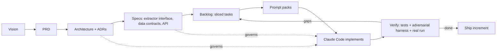

# AcquireIntel — AI-Native Engineering Kit

> This directory is **not the app**. It is the **durable engineering kit** you use to
> *build* the app by prompting Claude Code in a disciplined, spec-first way.
>
> Everything here is designed to outlive any single coding session. Wipe every working
> copy of the app and you lose nothing — the source of truth for *what to build* and
> *how to build it* lives here.

---

## What you are building

**AcquireIntel** is a **resilient, pluggable data-acquisition platform** in **Python**. Its
flagship dataset is **product & price intelligence**: it crawls online stores, extracts
product and price data through **three different acquisition techniques** — HTML scraping
(Scrapy + Playwright), **REST** APIs, and **GraphQL** APIs — stores an append-only
**price-history** time-series, and surfaces it through a **Flask** API + light dashboard.

The **star of the project is the acquisition engine and its anti-bot resilience layer**:
proxy rotation, fingerprint/header/cookie rotation, adaptive rate-limiting, backoff/retry,
ban detection, and session pools — all proven against a **local adversarial mock server**
you control (so the hard parts are deterministically testable) plus friendly real
endpoints.

It is deliberately shaped to demonstrate the exact competencies of a **Data Acquisition /
Research Engineer** role: Python; Scrapy/Playwright; REST + GraphQL; data collection in
adversarial environments (rate limits, blocking, anti-bot); networking fundamentals
(proxies, headers, cookies); scalable pipelines; data-quality monitoring; CI/CD.

---

## Why "AI-native engineering" (and not vibe coding)?

**Vibe coding** = prompt "build me a scraper," accept whatever comes out, iterate
reactively. It dies the moment a target rate-limits you or a selector drifts, because
there's no spec, no verifiable "done," and no way for a fresh agent session to resume.

**AI-native engineering** treats the agent as the *implementer* and you as the *director*,
with written artifacts as the contract between you:



The loop is **specify → slice → prompt → verify → integrate**. The adversarial mock harness
is what makes the *anti-bot* work verifiable by the agent itself — no human needed to
confirm "yes it rotated the proxy and backed off."

---

## How to use this kit

1. **Read the intent** — `docs/00-vision.md`, `docs/01-prd.md`.
2. **Understand the shape** — `docs/02-architecture.md`, **`docs/04-acquisition-and-antibot.md`**
   (the centerpiece), the ADRs, and `specs/`.
3. **Work the plan** — `plan/execution-playbook.md` is the operating procedure;
   `plan/backlog.md` holds vertically-sliced, acceptance-tested tasks.
4. **Prompt from the packs** — `prompts/` has copy-paste, spec-referencing prompts per phase.
5. **Let the agents specialize** — `.claude/agents/` defines role-scoped subagents
   (architect, acquisition-engineer, antibot-specialist, pipeline-engineer, qa-engineer).
6. **Verify every increment** — nothing is "done" until it meets the backlog's acceptance
   criteria and passes `docs/06-testing-strategy.md` (including the adversarial harness).

> **Golden rule:** if you change *what the software does*, change a doc/spec here **first**,
> then prompt the implementation. Code follows spec, never the reverse.

---

## Directory map

```
acquire-intel/
├── README.md                          ← you are here
├── CLAUDE.md                          ← project memory loaded every session
├── .claude/{settings.json,agents/,commands/}
├── docs/
│   ├── 00-vision.md
│   ├── 01-prd.md
│   ├── 02-architecture.md
│   ├── 03-data-model.md
│   ├── 04-acquisition-and-antibot.md  ← the resilience/anti-bot design (centerpiece)
│   ├── 05-tech-stack.md
│   ├── 06-testing-strategy.md         ← incl. the adversarial mock harness
│   ├── 07-observability.md
│   ├── 08-security-and-legal.md
│   └── adr/                           ← Architecture Decision Records
├── specs/
│   ├── openapi.yaml                   ← Flask API contract
│   ├── extractor-interface.md         ← the SourceExtractor plugin contract
│   └── data-contracts/                ← JSON Schemas for product/price/crawl entities
├── plan/{roadmap,milestones,backlog,execution-playbook}.md
├── prompts/{README,prompt-patterns,phase-0..phase-4}.md
└── templates/{adr,task,pr}-template.md
```

---

## The four senior perspectives baked in

| Role | Owns | Primary artifacts |
|------|------|-------------------|
| **Senior Product Manager** | *What & why, for whom* | `docs/00-vision.md`, `docs/01-prd.md`, `plan/roadmap.md` |
| **Senior Software Architect** | *Shape & boundaries* | `docs/02-architecture.md`, `docs/adr/`, `specs/` |
| **Senior Data Scientist / Acquisition Engineer** | *Ingestion, anti-bot, data quality* | `docs/04-acquisition-and-antibot.md`, `docs/03-data-model.md` |
| **Senior Software Developer** | *Implementation & verification* | `docs/05-tech-stack.md`, `docs/06-testing-strategy.md`, `plan/backlog.md`, `prompts/` |

---

## Quick start (TL;DR)

```text
1. Open this repo in Claude Code.
2. Say: "Read CLAUDE.md, docs/, and plan/execution-playbook.md, then start Phase 0."
3. Feed prompts from prompts/phase-0-bootstrap.md.
4. After each task, run the verification in plan/backlog.md (tests + adversarial harness).
5. Repeat per phase. Never skip a phase's verification gate.
```
