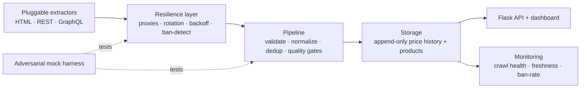

# 00 — Vision & North Star

*Owner: Senior Product Manager. Status: Approved baseline.*

## The one-liner

**AcquireIntel reliably turns messy, defended, public web sources into clean, current,
queryable product & price intelligence — and proves it did so honestly, with the receipts.**

The flagship dataset is product & price data. But the *real* product is the **acquisition
platform**: a resilient, pluggable engine that collects structured data from hostile web
environments (rate limits, blocking, anti-bot, JS-rendered pages, REST and GraphQL APIs)
without breaking and without silently caching garbage.

## The problem

Useful web data lives behind friction: pages render with JavaScript, APIs are undocumented
or GraphQL-only, endpoints rate-limit and block, layouts drift, and a naive scraper happily
stores a CAPTCHA page as if it were a product. Anyone who needs that data at scale —
price-intelligence teams, market researchers, aggregators — needs an acquisition system
that is **resilient, observable, and correct**, not a brittle one-off script.

## The north star

> **Collect defended public data reliably, respectfully, and verifiably — then keep it
> fresh and prove its provenance.**

"With the receipts" means every stored value is timestamped, attributed to a source and a
crawl run, and validated before storage. Trust in the data is the product.

## Who it's for

| Persona | Job to be done | What they get |
|---------|----------------|---------------|
| **Price-intelligence analyst** | "How are prices moving across stores?" | Price history, drops/deals, availability, per-product timelines |
| **Data/market researcher** | "Give me clean structured data from site X" | A resilient extractor per source, normalized to one schema |
| **Platform operator** | "Is collection healthy and fresh?" | Crawl-run health, ban-rate, proxy health, freshness SLA |
| **The engineer (you)** | "Prove I can build adversarial acquisition" | A portfolio system demonstrating every named JD skill |

Primary persona for v1: the **price-intelligence analyst** — but every architectural choice
is made to showcase **acquisition engineering**.

## What success looks like

**Product outcomes:**
- One command collects product & price data from ≥3 sources spanning **HTML, REST, and
  GraphQL**, into a single normalized schema, with visible freshness.
- The system survives rate limits and blocks: it throttles, rotates identity, backs off,
  retries, and **never persists a blocked/invalid response as data**.
- Every price point is traceable to a source + crawl run + capture time.

**Engineering outcomes (the ones that get the job):**
- The **anti-bot resilience layer** is a first-class, tested component — provably correct
  against a controllable adversary.
- Adding a new source is a bounded task: implement one extractor, register it.
- Zero secrets in the repo; proxies/keys via config; respectful, documented crawl policy.
- Green CI: lint, types, unit + integration + adversarial-harness tests.

## Non-goals (v1)

- Not a general-purpose search engine or a proxy-selling service.
- Not real-time/streaming; **scheduled + on-demand batch** collection is enough.
- Not a place to defeat authentication or collect PII — **public catalog/price data only**.
- Not a heavy analytics/ML product; analytics in v1 is transparent price math (history,
  drops, availability). The depth is in *acquisition*, not modeling.
- Not tied to one retailer — sources are pluggable; no single hostile giant is a dependency.

## Guiding principles

1. **Resilience is the product.** A collector that dies on the first `429` is worthless.
   Throttle, rotate, back off, recover — by design.
2. **Never cache garbage.** A blocked/CAPTCHA/empty response is a *failure*, detected and
   recorded — never stored as data. (This is a data-quality gate, not an afterthought.)
3. **Respectful & legal by default.** Public data, `robots.txt`-aware, polite rates,
   honest User-Agent. Anti-bot handling is for *reliability*, not trespass.
4. **Pluggable sources.** HTML, REST, GraphQL all reduce to one canonical schema behind one
   extractor contract.
5. **Everything verifiable.** The hard parts (resilience) are proven against a deterministic
   adversarial harness so the system — and the AI building it — can self-verify.
6. **Build AI-native.** Specs and plans are the DNA; the implementation is regenerable.

## How the capabilities build on each other

The flagship price-intelligence views are the visible surface. Everything beneath exists to
make collection **resilient, correct, fresh, and provable** — which is the skill this
project is meant to demonstrate.
