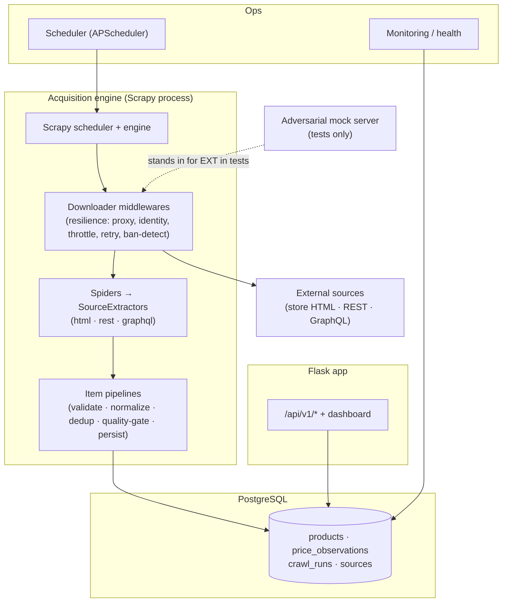
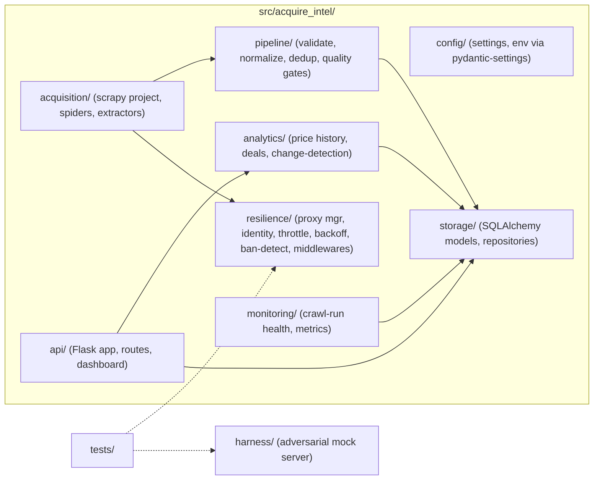
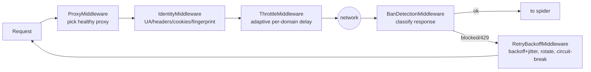
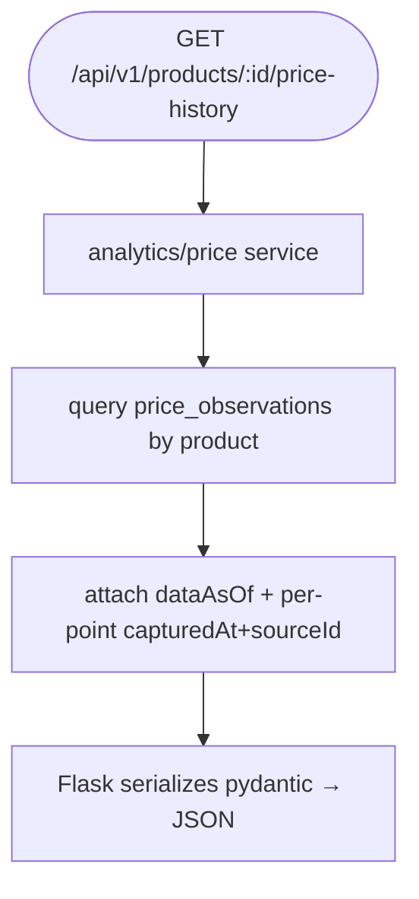
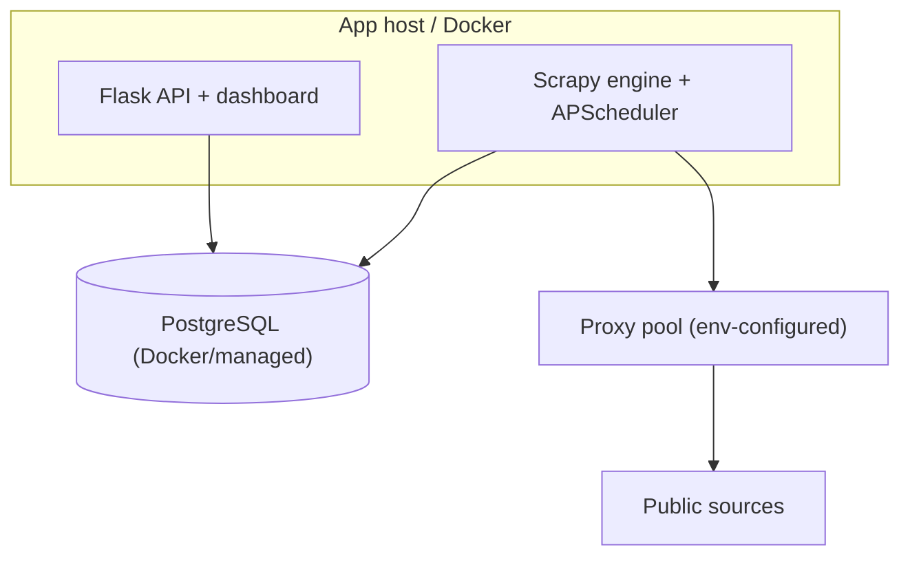

# 02 — System Architecture

*Owner: Senior Software Architect. Companion: ADRs in `docs/adr/`, `specs/`,
`docs/04-acquisition-and-antibot.md`.*

Authoritative shape of the system. Implementation conforms to it; disagreements are
resolved by a superseding ADR, not by drifting code.

---

## 1. Goals & the forces behind them

| Goal | Driven by | Consequence |
|------|-----------|-------------|
| Resilient collection from defended sources | JD anti-bot focus; FR-5/FR-6 | Resilience layer as Scrapy middlewares + `resilience` module (ADR-0005) |
| Multiple acquisition techniques | HTML+REST+GraphQL (FR-2/3/4) | `SourceExtractor` protocol with `html`/`rest`/`graphql` kinds (ADR-0003) |
| Never cache garbage | Correctness NFR; FR-6/FR-7/FR-9 | Ban detection + pydantic validation + data-quality gates before persist (ADR-0008) |
| History is first-class | Price intelligence (FR-12) | Append-only `price_observations` time-series (ADR-0006) |
| Verifiable anti-bot | Agent must self-verify | Deterministic adversarial mock harness (ADR-0009) |
| Respectful & legal | Legal NFR | robots/rate policy per source; public data only (docs/08) |
| Regenerable by an AI agent | AI-native build | Strict layering, typed contracts, spec-driven boundaries |

## 2. Container view



## 3. Package/module structure



Each source is a **vertical slice**: an extractor module + a per-source config, reusing the
shared resilience/pipeline/storage. Adding a source touches only `acquisition/` +
registration.

## 4. Collection flow (happy path + resilience)

```mermaid
sequenceDiagram
    participant Sched as Scheduler/CLI
    participant Eng as Scrapy engine
    participant Res as Resilience middlewares
    participant Ext as SourceExtractor
    participant Src as Source (or harness)
    participant Val as pydantic + quality gates
    participant DB as Postgres
    participant Run as CrawlRun ledger

    Sched->>Eng: crawl(source)
    Eng->>Run: open run {source, startedAt, running}
    loop each request
        Eng->>Res: prepare request
        Res->>Res: pick proxy + identity (UA/headers/cookies/fingerprint)
        Res->>Res: apply adaptive throttle (per-domain politeness)
        Res->>Src: send
        Src-->>Res: response
        Res->>Res: classify (ok | 429 | 403-block | captcha | empty)
        alt blocked / rate-limited
            Res->>Res: record ban event; backoff+jitter; rotate identity/proxy; retry
            Note over Res: blocked response is NEVER passed downstream as data
        else ok
            Res-->>Ext: response
            Ext->>Val: normalize → ProductObservation → validate + quality gates
            alt valid
                Val->>DB: upsert product + append price observation (dedup)
            else invalid/anomalous
                Val->>Run: record rejected/quarantined item
            end
        end
    end
    Eng->>Run: close run {status, itemCount, banEvents, timings}
```

Key invariants:
- **Blocked/invalid responses never reach storage.** They are ban events or rejected items,
  recorded in the run.
- **Immutable observations.** Price observations are append-only; product rows are upserts.
- **One source's failure is isolated** — the run records it; other sources are unaffected.

## 5. The SourceExtractor contract

The single extension point (full spec: `specs/extractor-interface.md`, ADR-0003).

```python
# src/acquire_intel/acquisition/base.py (target shape)
class SourceExtractor(Protocol):
    id: str                      # "demo_rest", "demo_graphql", "demo_html"
    kind: Literal["html", "rest", "graphql"]
    stale_after: timedelta       # freshness budget

    def start_requests(self) -> Iterable[Request]: ...
    def parse(self, response) -> Iterable[RawProduct]: ...  # source-native → RawProduct
```

`RawProduct` (source-native) is normalized by the pipeline into the canonical `Product` +
`PriceObservation` (`docs/03`). Extractors contain **only** source-specific logic; they do
not manage proxies, throttling, storage, or validation — those are shared layers.

## 6. Resilience layer (see `docs/04` for the deep design)

Implemented primarily as Scrapy **downloader middlewares** so every request benefits
uniformly:



## 7. Read/serve path



Reads never trigger collection inline; collection is the scheduler's/CLI's job.

## 8. Deployment topology (target)



The Scrapy engine + scheduler run as one worker process for v1; the extractor/resilience
design keeps a future multi-worker (queue-backed) split open without rewriting sources.

## 9. Cross-cutting

- **Config:** `config/` uses `pydantic-settings` to parse env once and fail fast. No
  `os.environ` access elsewhere. Per-source config (rate, concurrency, robots policy,
  stale_after) lives in typed config objects.
- **Validation:** pydantic models in one place define every wire/DB/extractor shape; they
  are the runtime source of truth (ADR-0008). Published JSON Schemas in
  `specs/data-contracts/` mirror them (parity test).
- **Errors:** typed exceptions; API error handler → `application/problem+json`; full context
  to logs, nothing sensitive to clients.
- **Logging/metrics:** `structlog` JSON logs with `run_id`/`request` context; monitoring
  derives health/freshness/ban-rate from `crawl_runs` (`docs/07`).
- **Time & money:** UTC everywhere; `Decimal` + ISO-4217 currency for prices.

## 10. What is intentionally simple (YAGNI)

- Single-node concurrent crawling (Scrapy handles concurrency) — no distributed queue in v1.
- Postgres is both store and read model — no separate cache tier.
- One Flask process — no microservices.
- Transparent price math — no ML.

Revisit each only when a concrete requirement forces it, recorded as an ADR.
