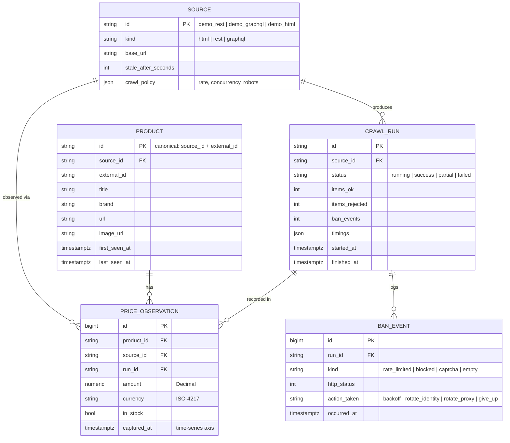
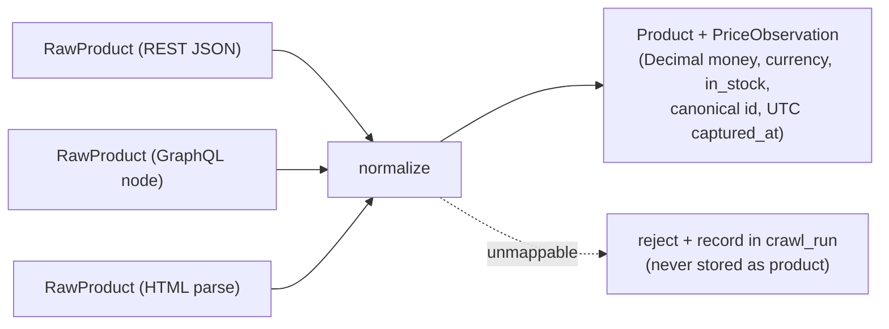

# 03 — Data Model

*Owner: Senior Data Scientist / Acquisition Engineer + Architect. Companion:
`specs/data-contracts/`, `docs/04-acquisition-and-antibot.md`.*

Built around one idea: **price history is first-class**. We separate *immutable
observations* (append-only) from *derived projections* (current product state) that can be
recomputed, and we keep a **collection audit trail** so every value is traceable.

## 1. Entities overview

## 2. Table details

### 2.1 `price_observations` — the source of truth (append-only time-series)
- One row per (product, source, crawl run) capture. **Immutable** — never updated/deleted
  except by retention.
- `captured_at` is the time axis; indexed with `product_id` for fast per-product history.
- Money is `NUMERIC` (mapped to Python `Decimal`) + ISO-4217 `currency`. Never a float.
- Enables: price history, deal/drop detection, availability timelines.

### 2.2 `products` — canonical projection (upsert)
- One row per canonical product (`source_id` + `external_id`). Holds latest descriptive
  fields + `first_seen_at`/`last_seen_at`. Rebuildable from observations + latest crawl.

### 2.3 `crawl_runs` — collection audit & health ledger
- One row per crawl attempt per source. Records `status`, `items_ok`, `items_rejected`,
  `ban_events`, and `timings`. Powers `/health`, freshness, and ban-rate metrics.
- This is what makes collection **observable** and every value **traceable** to a run.

### 2.4 `ban_events` — anti-bot audit trail
- One row per detected block/rate-limit/CAPTCHA/empty response and the action taken. This
  is a portfolio-visible proof that the resilience layer *works and is measured* — you can
  literally chart ban-rate and recovery.

### 2.5 `sources` — the source registry
- Config per source: kind, base URL, `stale_after`, crawl policy (rate/concurrency/robots).
  Adding a source adds a row + an extractor module.

## 3. Canonical normalization

Extractors emit source-native `RawProduct`; the pipeline normalizes to the canonical model:

Normalization rules (examples): currency strings → `Decimal` + ISO-4217; strip and
canonicalize titles; derive `external_id` from source id; coerce availability to
`in_stock: bool`.
Unmappable/invalid items are **rejected and counted**, never silently stored.

## 4. Retention & indexing

| Data | Retention | Key indexes |
|------|-----------|-------------|
| `price_observations` | Long (history is the point) | `(product_id, captured_at DESC)`, `(source_id, captured_at DESC)` |
| `products` | Current, rebuildable | `(source_id, external_id)` unique |
| `crawl_runs` | Rolling (e.g. 90d) | `(source_id, started_at DESC)` |
| `ban_events` | Rolling (e.g. 90d) | `(run_id)`, `(kind, occurred_at)` |

(Optional: a native Postgres partitioned/hypertable strategy for `price_observations` if
volume grows — record as an ADR when needed.)

## 5. Data contracts

Canonical shapes live as JSON Schema in `specs/data-contracts/` **and** as pydantic models
in `src/acquire_intel/`. The pydantic models are the runtime source of truth; the JSON
Schemas are the published contract. A parity test asserts they match (ADR-0008).

## 6. Design principles (and the pitfalls they avoid)

| Naive approach | AcquireIntel |
|----------------|--------------|
| Overwrite latest price only | Append-only observation history |
| Store price as float / no currency | `Decimal` + ISO-4217 currency |
| Cache whatever the fetch returns | Validate + quality-gate before persist; reject blocks/garbage |
| No record of collection attempts | `crawl_runs` + `ban_events` audit trail |
| Source-specific rows everywhere | One canonical schema behind an extractor contract |
