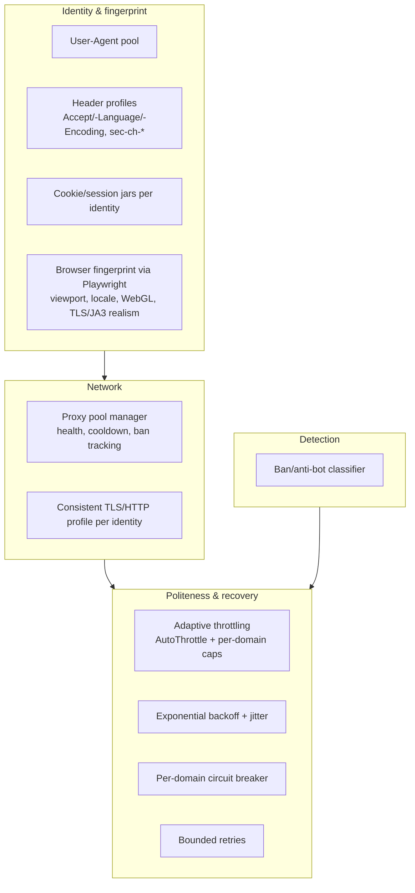
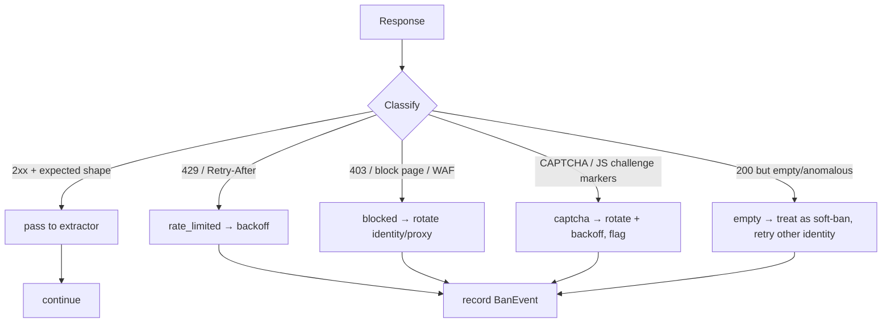

# 04 — Acquisition & Anti-Bot Resilience (the centerpiece)

*Owner: Senior Acquisition Engineer. Companion: `docs/02-architecture.md` §6,
`docs/06-testing-strategy.md` (adversarial harness), ADR-0005/0009.*

This is the heart of the project and the skill it exists to demonstrate: **collecting
structured data reliably from defended public web sources**. Every mechanism here is
concrete, isolated, and — crucially — **verifiable against a controllable adversary** so
correctness doesn't depend on a live hostile site.

> **Ethos:** these techniques exist to make collection of **public** data **reliable and
> polite**, not to defeat authentication, access private data, or ignore a site's stated
> wishes. See `docs/08-security-and-legal.md`.

---

## 1. The three acquisition techniques

One canonical schema, three ways in — each a `SourceExtractor` (ADR-0003):

| Kind | Tooling | When | Challenges it showcases |
|------|---------|------|--------------------------|
| **REST** | Scrapy `Request` + JSON | A JSON/REST endpoint exists (e.g. `products.json`) | Pagination, rate limits, auth headers |
| **GraphQL** | Scrapy `Request` (POST) + query builder | A GraphQL endpoint exists (e.g. Storefront API) | Query construction, cursor pagination, variables |
| **HTML** | Scrapy + `scrapy-playwright` | JS-rendered pages, no clean API | Headless rendering, waiting for content, selector resilience |

The REST/GraphQL paths prove API-extraction skill; the HTML+Playwright path proves
browser-automation skill. All three flow through the same resilience + pipeline layers.

## 2. The resilience layer — components

Implemented as Scrapy downloader middlewares + a `resilience/` module so all requests
benefit uniformly.



### 2.1 Proxy pool manager
- Env-configured pool of proxies (works with 0 proxies for local/harness runs).
- Tracks per-proxy health: success rate, last ban, cooldown. Picks a healthy proxy;
  quarantines one that starts getting blocked.
- **Never hardcoded**; supplied via config/env. Absent proxies → direct connection (fine for
  the harness and friendly endpoints).

### 2.2 Identity & fingerprint rotation
- An **identity** = a coherent bundle: User-Agent + matching header profile + cookie jar +
  (for Playwright) viewport/locale/fingerprint. Rotating *coherently* matters — a Chrome UA
  with Firefox headers is itself a bot signal.
- Rotate per-session or on ban, not randomly per request (consistency avoids detection).

### 2.3 Adaptive throttling (politeness first)
- Scrapy **AutoThrottle** + explicit per-domain concurrency/delay caps from source config.
- Politeness is the first-line anti-ban tool: most blocks are earned by being greedy. We
  crawl slowly and concurrently within limits.

### 2.4 Backoff, retry, circuit-breaking
- On `429`/`503`/transient errors: exponential backoff **with jitter**, honoring
  `Retry-After` when present; bounded retries.
- Per-domain **circuit breaker**: after repeated blocks, pause that domain (cool-down)
  rather than hammering it.

### 2.5 Ban / anti-bot detection (the "never cache garbage" gate)
Classifies every response *before* it reaches an extractor:



Signals used: HTTP status, known block/WAF/CAPTCHA markers in body, response size vs.
expectation, redirect-to-challenge, missing expected selectors/keys. A classified ban is
**recorded as a `BanEvent`** and triggers recovery — it is **never** parsed into a product.

## 3. Reliability & self-healing

- **Selector/shape resilience:** extractors validate their own output; if expected
  fields/selectors vanish (site drift), the item is rejected and the run flags a possible
  format change (FR-16 change detection).
- **Volume/continuity gates:** a run returning far fewer/more items than the source's recent
  baseline is quarantined, not committed (`docs/03`, pipeline gates).
- **Idempotent runs:** re-running collection appends observations without corrupting state;
  products upsert.

## 4. How this is proven (deterministically)

The anti-bot layer is only credible if it's tested. We test it against a **local
adversarial mock server** (`harness/`, ADR-0009, `docs/06`) that we fully control:

```mermaid
sequenceDiagram
    participant T as pytest
    participant H as Adversarial mock server
    participant M as Resilience middlewares
    T->>H: configure scenario (e.g. 403 after 5 reqs/identity)
    T->>M: run collector against H
    M->>H: requests (rotating identity/proxy, throttled)
    H-->>M: 200 ... then 403 block ... then 200 for new identity
    M->>M: detect ban → rotate → backoff → recover
    M-->>T: run completes; BanEvents recorded; 0 garbage persisted
    T->>T: assert recovery + no blocked response stored
```

Scenarios the harness simulates: `429 + Retry-After`, `403` block after N requests per
identity/IP, CAPTCHA/JS-challenge page, cookie-wall (must carry cookies), soft-ban (200 +
empty), and a happy path. Each maps to a resilience behavior with a deterministic assertion.

**This is the crux of the whole project:** it lets you *demonstrate* adversarial-collection
mastery on your résumé and lets Claude Code *verify its own implementation* — no live
hostile target, no flakiness.

## 5. Metrics the layer emits (see `docs/07`)

| Metric | Meaning |
|--------|---------|
| `ban_events_total{kind}` | rate_limited / blocked / captcha / empty counts |
| `ban_rate{source}` | ban events ÷ requests — the headline resilience KPI |
| `identity_rotations_total` / `proxy_rotations_total` | recovery activity |
| `request_retries_total` / `backoff_seconds` | politeness/recovery cost |
| `proxy_health{proxy}` | success rate per proxy |
| `items_ok` / `items_rejected` | pipeline yield & quality |

Charting `ban_rate` trending toward zero as identities rotate is the visible proof the
resilience layer works.

## 6. Deliberate boundaries
- No attempt to break authentication, solve CAPTCHAs via third-party solvers, or access
  non-public data. If a target requires that, it's **out of scope** — pick a public source.
- Proxies and fingerprints are for *reliability and politeness distribution* on public data.
- `robots.txt` obeyed by default; any per-source exception is documented in `docs/08` with a
  reason and respectful rate limits.
