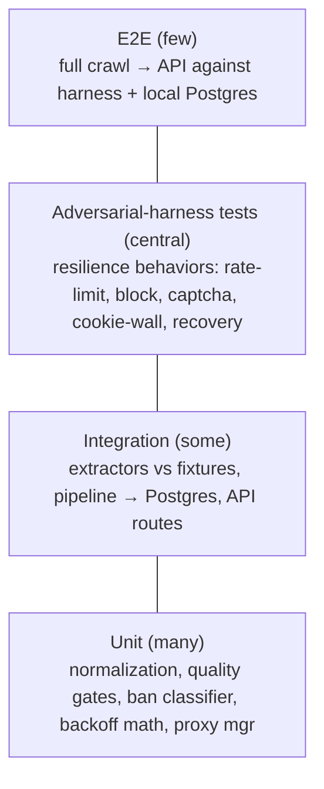
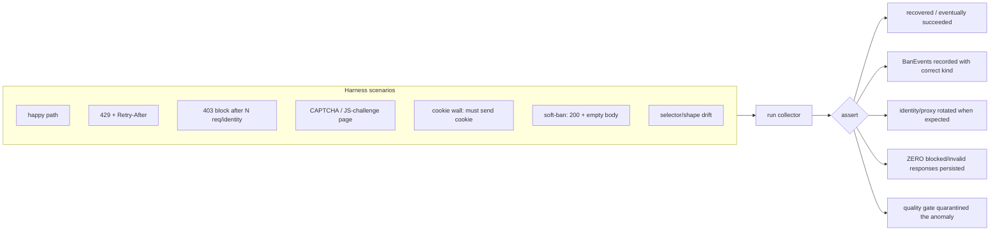
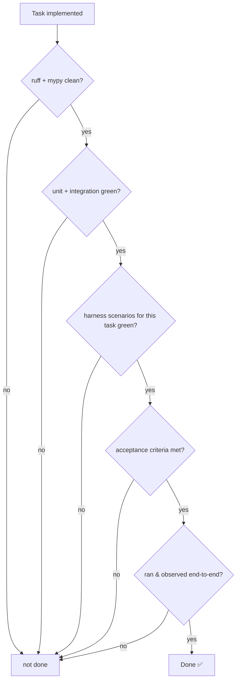

# 06 — Testing Strategy (the Definition of "Verified")

*Owner: Senior Developer + QA. Nothing is "done" until it satisfies this document.*

"Verified" is a concrete, enforceable bar. The **adversarial mock harness** is what makes
the hardest part — anti-bot resilience — testable *deterministically*, so both the engineer
and the AI agent can prove it works without a live hostile site.

## 1. The test pyramid

Unlike a typical web app, a *huge* share of confidence here comes from the **harness tier**,
because resilience is the product and the prototype-killer bug (caching a block page) lives
exactly there.

## 2. What must be tested, by layer

| Layer | Tool | Coverage expectation |
|-------|------|----------------------|
| `resilience/` (ban classifier, backoff, proxy mgr, identity rotation) | pytest, unit | Exhaustive + deterministic. Backoff math, jitter bounds, classifier decisions, proxy health transitions. |
| Resilience **behaviors** (end-to-end within engine) | pytest + **adversarial harness** | Every scenario in §4; assert recovery + **zero garbage persisted**. |
| `acquisition/` extractors (html/rest/graphql) | pytest vs **saved fixture payloads** | Each extractor parses a real captured payload into valid `RawProduct`s; malformed/blocked payload → rejected/raises, never junk. |
| `pipeline/` (normalize, dedup, quality gates) | pytest, unit | Money→Decimal+currency, dedup, volume/range/continuity gates; anomalies quarantined. |
| `storage/` | pytest + Postgres (Docker/testcontainers) | Append-only observations; product upsert; run/ban-event records. |
| `api/` (Flask) | pytest + test client | Each route: happy, validation (400), not-found (404), auth (401) on admin; freshness fields present. |
| `config/` | pytest | Missing/invalid env fails fast; pydantic-settings parses. |
| Contracts | pytest | pydantic ↔ published JSON Schema parity. |

## 3. Fixture discipline

- Extractors and pipeline logic are tested against **checked-in fixture payloads** (captured
  REST JSON, GraphQL responses, HTML snapshots) plus expected normalized output. This locks
  parsing correctness and catches source drift.
- Fixtures live in `tests/fixtures/<source>/`. Updating one is a deliberate, reviewed change.

## 4. The adversarial harness (central)

A local mock server (`harness/`) with configurable scenarios. Tests point the collector at
it instead of a real site.

**Mandated harness assertions** (per relevant FR):
- 429 → backoff observed (respecting Retry-After), then success.
- 403-after-N → identity/proxy rotation, then success with a fresh identity.
- CAPTCHA/challenge → classified as ban, `BanEvent{kind: captcha}`, **not** parsed.
- cookie-wall → session cookie carried on subsequent requests → success.
- soft-ban → treated as ban, retried under a new identity.
- drift → item rejected + run flags possible format change.
- In **every** scenario: `items_rejected`/`ban_events` recorded and **no garbage in
  `price_observations`**.

## 5. The verification gate (per backlog task)

"Ran & observed" = exercised the real interface: a crawl against the harness (or a friendly
endpoint) producing rows in Postgres with correct freshness, or an API call returning the
right shape — not merely a green test.

## 6. CI (GitHub Actions)

On every PR: `uv sync` → `ruff check` → `mypy` → `pytest` (unit + integration + harness),
with a Postgres service container. E2E on merge/nightly to keep PRs fast. Red = no merge.

## 7. Coverage philosophy
No vanity coverage %. We require: near-total on `resilience/`, `pipeline/`, extractors, and
contracts (silent bugs there corrupt data); every API branch; and full scenario coverage in
the harness. State/behavior coverage over line counts.

## 8. Isolation
- Integration/storage tests use a disposable Postgres (Docker service or testcontainers).
- **No test hits a real external source.** Extractors via fixtures; resilience via the
  harness. This keeps the suite fast, deterministic, and legal.
