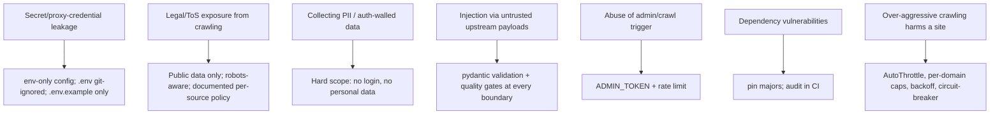

# 08 — Security, Privacy & Legal

*Owner: Senior Architect + Product Manager.*

A scraping platform lives or dies on doing this responsibly. This posture is what makes the
project **impressive to a professional** (rather than reckless): capable anti-bot
engineering applied *only* to public data, politely, and within a defensible policy.

## 1. Threat & risk model

## 2. Responsible-crawling policy (the professional core)

This is what separates senior from reckless, and it is a deliberate feature:

- **Public data only.** Catalog/price data that a site serves publicly. **No** authentication
  bypass, **no** login-walled content, **no** personal data.
- **`robots.txt` obeyed by default** (`ROBOTSTXT_OBEY=true`). Any per-source exception must
  be recorded here with a reason and *stricter* rate limits — and only for data the site
  publishes openly.
- **Polite by default.** AutoThrottle on, conservative `DOWNLOAD_DELAY`, per-domain
  concurrency caps, backoff on `429`, circuit-breaker on repeated blocks. We aim to be
  *lighter than a human browsing*.
- **Honest identification.** A `CONTACT_USER_AGENT` with a contact address, so an operator
  can reach you.
- **Anti-bot handling is for reliability, not trespass.** Proxy/identity rotation exists to
  survive rate limits and distribute load on *public* endpoints — not to defeat access
  controls. If a source genuinely doesn't want to be collected, we don't.
- **ToS review per source before adding it.** This kit encodes intent; the operator owns the
  legal sign-off. Prefer sources with public/official data endpoints (e.g. a store's public
  `products.json` / public GraphQL Storefront API).

> **Operator action before launch:** confirm each target source's ToS and `robots.txt`, and
> keep collection to public data at respectful rates.

## 3. Secrets management
- All credentials (DB URL, `ADMIN_TOKEN`, `PROXY_POOL`, any API keys) come from env, parsed
  once via `pydantic-settings`. `.env` git-ignored; ship `.env.example` (keys, no values).
- No secret/proxy credential/cookie is ever logged (redaction, `docs/07`).

## 4. AuthZ
- Read endpoints are public (public data). **On-demand crawl trigger** (`POST
  /admin/crawl`) requires `Authorization: Bearer <ADMIN_TOKEN>` and is rate-limited. No
  crawl can be triggered by an anonymous caller.

## 5. Input validation & injection defense
- Every HTTP request (params/body) validated by pydantic before a service runs.
- Every upstream payload validated + quality-gated before storage; untrusted shape is never
  trusted (kills the "store a block page as data" bug class).
- SQLAlchemy parameterized queries only; never string-built SQL.

## 6. Privacy / PII
- v1 stores **no personal data** — only public product/price catalog data. If a future
  source risks PII, it's out of scope until a policy exists.
- No end-user tracking/telemetry in v1.

## 7. Dependency & supply-chain hygiene
- Pin majors; commit `uv.lock`; run an audit (e.g. `pip-audit`) in CI. No `curl | sh`
  installs (denied in `.claude/settings.json`).

## 8. Security & compliance checklist (gate before any real-target run/deploy)
- [ ] No secret/proxy cred in git or logs; `.env.example` only.
- [ ] Target is public data; `robots.txt` reviewed; per-source policy documented here.
- [ ] AutoThrottle + per-domain caps + backoff active; rates respectful.
- [ ] `CONTACT_USER_AGENT` set with a real contact.
- [ ] No auth-walled/PII targets.
- [ ] `ADMIN_TOKEN` set; crawl trigger gated + rate-limited.
- [ ] All inputs pydantic-validated; quality gates active.
- [ ] Dependency audit clean (or triaged) in CI.
