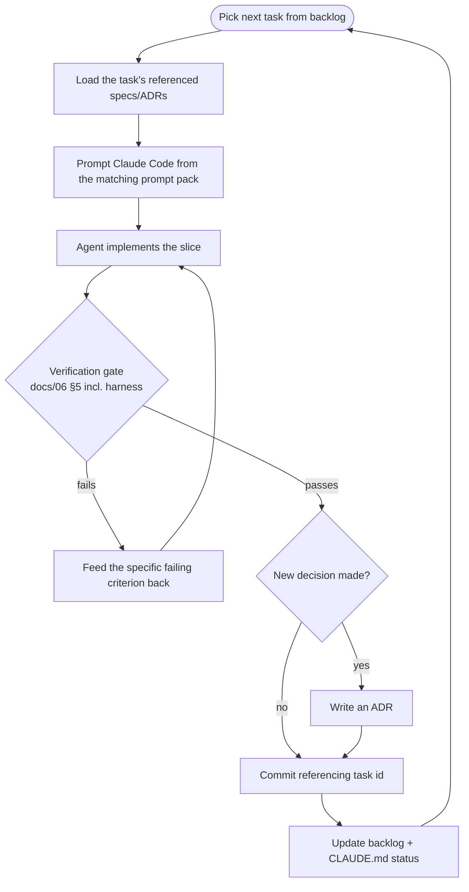

# Execution Playbook — How to Build This with Claude Code

*The operating procedure. Follow it literally. It converts the specs in this kit into
working software through disciplined prompting.*

## The operating loop

## Step-by-step

### 0. Session start (every time)
> "Read `CLAUDE.md`, then `plan/execution-playbook.md`, then the specs referenced by the next
> unchecked task in `plan/backlog.md`. Summarize the task, its acceptance criteria, and the
> governing specs before writing any code."

### 1. Select exactly one task
Top unchecked task in the current phase. One vertical slice at a time — never batch.

### 2. Load its governing specs
Each task references PRD FRs, ADRs, and docs (esp. `docs/04` for resilience tasks). Read them
so the implementation conforms rather than improvises.

### 3. Prompt from the pack
Open the matching `prompts/phase-*` file, copy the task prompt, fill blanks, send. Don't
free-hand — keep prompts version-controlled.

### 4. Enforce the verification gate
Not done until `docs/06` §5 passes: ruff + mypy ✓, unit/integration ✓, **harness scenarios ✓
(for resilience tasks)**, acceptance criteria ✓, observed running ✓. On failure, feed back
the specific failing criterion.

### 5. Capture decisions as ADRs
A real choice forced by implementation (a library, a formula, a schema not already specified)
→ write an ADR before committing.

### 6. Commit small, reference the task
One task = one focused commit/PR; message references the task id (e.g. `T3.2: ban
classifier`). Keep diffs reviewable.

### 7. Update status
Check the task off in `plan/backlog.md`; update the "Current status" line in `CLAUDE.md`.

## Rules of engagement (non-negotiable)

1. **Spec before code.** Behavior change → update the doc/spec first.
2. **One task at a time.** Vertical slices, not horizontal layers.
3. **Verify by observing**, not asserting — tests **plus** a real run/crawl.
4. **Never persist a blocked/invalid response.** Detect, record, recover.
5. **Never trust upstream shape** — pydantic-validate at the boundary.
6. **No secrets/proxies in code** — env only.
7. **Respectful, public-data crawling** — robots-aware, throttled, honest UA (docs/08).
8. **Prove resilience against the harness**, never a live hostile site.
9. **Decisions become ADRs** — don't drift.

## When to use specialized subagents

`.claude/agents/` defines role-scoped agents. Delegate when a task is squarely one role's
domain:
- **architect** — before a phase, or when a task needs a design/ADR decision.
- **acquisition-engineer** — extractors, Scrapy/Playwright, REST/GraphQL (Phase 1–2).
- **antibot-specialist** — the resilience layer + harness (Phase 3): proxies, rotation,
  throttle/backoff, ban detection.
- **pipeline-engineer** — validation, normalization, quality gates, storage, analytics.
- **qa-engineer** — tests, harness scenarios, the verification gate.

Invoke by name only when the user asks or a whole task cleanly belongs to one role; otherwise
implement inline.

## Anti-patterns to refuse
- "Just build the scraper." → No. Slice by backlog task.
- "Skip the harness/tests for now." → No. They are the definition of done.
- "Point it at a real site to test anti-bot." → No. Use the harness (deterministic, legal).
- "Cache the response, we'll validate later." → No. Validate/gate before persist.
- "Hardcode the proxy/target/DB URL." → No. Config + env.
- "Disable robots to get more data." → No. Respectful crawling is a feature.

## Phase-completion checklist
Before advancing phases, confirm the milestone DoD (`plan/milestones.md`) and the phase gate
(`plan/roadmap.md`). A phase is complete when its **gate demo** works and is verified — not
merely when tasks are checked.
