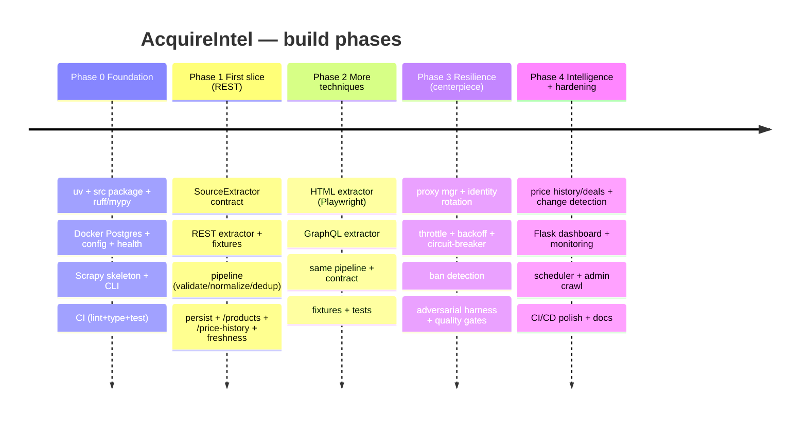

# Roadmap

*Owner: Senior Product Manager. Phases map to milestones in `milestones.md` and tasks in
`backlog.md`.*

Vertical-slice first: prove the whole pipeline on one *easy* technique (REST), then add
techniques, then make it *resilient* (the centerpiece), then add intelligence & polish.

## Phase gates

| Phase | Ships | Gate to advance |
|-------|-------|-----------------|
| 0 | Runnable skeleton; Postgres up; health green; CI green | `docker compose up` + `uv run` boot; `/health` 200; CI passes |
| 1 | One REST source end-to-end | crawl REST source → observations in Postgres → `/products` + `/price-history` return data with freshness |
| 2 | 3 techniques under one contract | HTML (Playwright) + GraphQL extractors pass fixture tests; all feed the same pipeline |
| 3 | Resilient, provable anti-bot | all harness scenarios green; ban events recorded; **zero garbage persisted**; quality gates active |
| 4 | Portfolio-ready product | dashboard (price history + crawler health), scheduler, admin crawl, CI/CD, README/demo |

## Sequencing rationale

- **REST first** (Phase 1) is the simplest technique — it proves discover→fetch→parse→
  validate→persist→serve without JS or GraphQL complexity, so the pipeline exists before we
  add harder extractors.
- **Techniques before resilience** (Phase 2 before 3): get all three extraction paths working
  against friendly/fixture inputs, *then* harden the shared request path once — resilience is
  a cross-cutting layer, cheaper to add to a working pipeline than to retrofit per source.
- **Resilience is its own phase** (Phase 3) because it's the headline skill and needs the
  adversarial harness built alongside it. This is where the project earns the interview.
- **Intelligence & polish last** (Phase 4): price history, deals, dashboard, scheduling — the
  visible product that makes the engineering legible to a reviewer.

## The portfolio angle (keep in view)
By the end, the repo should let a reviewer, in 5 minutes, see: three acquisition techniques,
a tested anti-bot layer beating a simulated adversary (charted ban-rate → 0), a clean
pipeline that never stores garbage, price-history charts, and green CI. That is the demo
that maps to the job.
